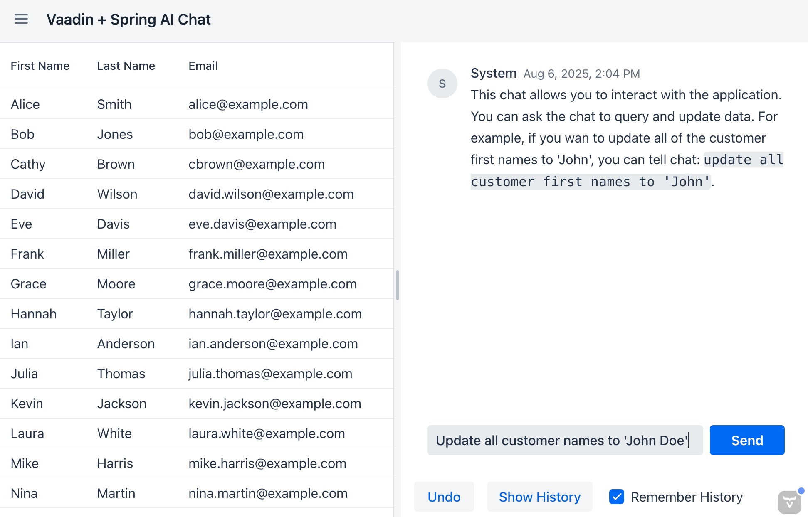

# Vaadin + Spring AI Chat Demo
Simple application that demonstrates leveraging Spring AI for viewing, editing, and managing data, in real-time, via a chat window. This demo uses the following:
 - [Vaadin](https://vaadin.com/) for the UI framework + components
 - [Spring AI](https://spring.io/projects/spring-ai) for interacting with AI models
 - [OpenAI](https://openai.com/) for the AI model



## Features of demo
Below are a few details of what this application demonstrates:

### AI chat interface
A simple chat interface component, built with [Vaadin](https://vaadin.com/), where users can interact with the AI. This is a generic chat interface which can be connected to your application services.  This interface also allows users to toggle on/off chat history, undo actions, and view a full history of previous messages.

### Real-time data management
Users can view and edit customer entities in real-time through the chat interface. This view shows a live view of the customer database next to the AI chat component which can be used to query and update customer data. This allows users to modify real entities via chats such as `Update customer John Doe's email to 'new.john.doe@email.com'`.


## Prerequisites
Before running the application, you need to set your Open AI API key in the `application.properties` file:

```properties
spring.ai.openai.api-key=your-openai-api-key-here
```

If you do not have an Open AI API key, you can find it here: [OpenAI API Keys](https://platform.openai.com/settings/organization/api-keys). Note that you may need to create an account and set up billing to use the API. Spring AI does support other AI providers.

## Running the application

To start the application in development mode, import it into your IDE and run the `Application` class. 
You can also start the application from the command line by running: 

```bash
./mvnw
```

To build the application in production mode, run:

```bash
./mvnw -Pproduction package
```

